# How to set up the robot

## Contents

- [Components](#components-and-where-they-are-in-the-bay)

    - [MATE ROV Shelf](#mate-rov-shelf)
    - [MATE ROV Robot Table](#mate-rov-robot-table)
    - [Computer Shelf](#computer-shelf)
    - [Components List](#components-list)
- [Setup](#setup)
    - [Control Box](#control-box)
    - [Pneumatics](#setting-up-pnuematics)
    - [Connecting the Robot](#connecting-the-robot)
    - [Run the GUI](#run-the-gui)
- [Tear Down](#tear-down)
    - [Initial Power Off](#initial-power-off)
    - [Disconnecting Pneumatics](#disconnecting-pneumatics)

## Components (and where they are in the bay)

### MATE ROV Shelf

When you walk into the bay, turn right and this is the shelf against the rightmost wall next to the green cabinets (the shelf facing you).

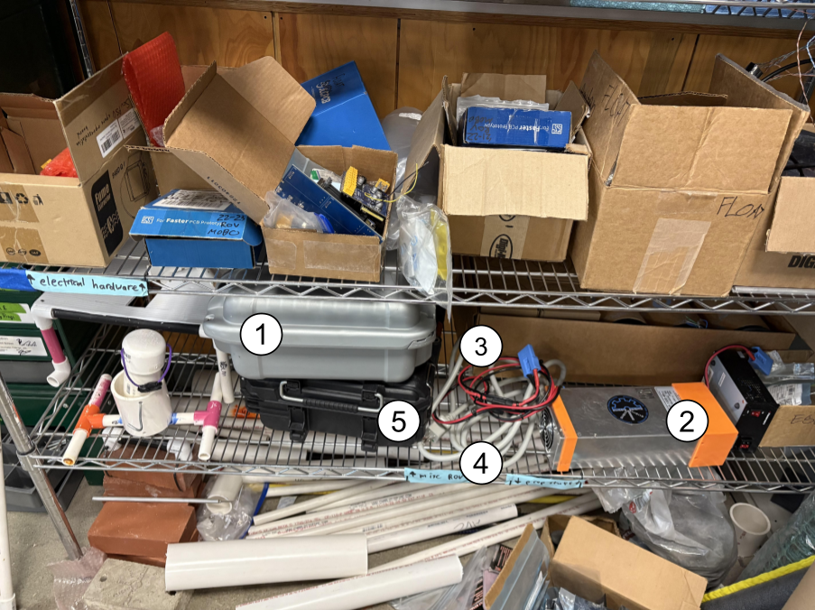

### MATE ROV Robot Table

When you walk into the bay, turn left, and you will run into it.

### Computer Shelf

When you walk into the bay, this is the shelf immediately on the right.

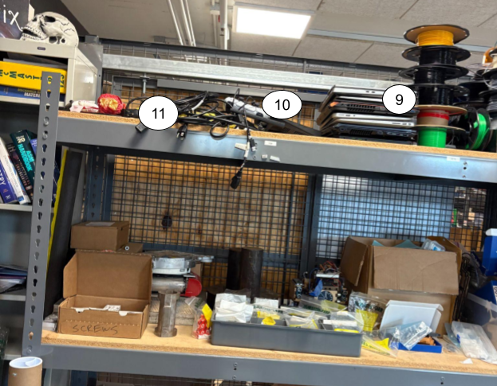

### Components List

| Number | Item | Location | Picture |
| --- | --- | --- | --- |
| 1 | Control Box | MATE ROV Shelf | |
| 2 | Small Backup Power Supply | MATE ROV Shelf | |
| 3 | Power Cord Extension (Blue Connector Cords) | MATE ROV Shelf | 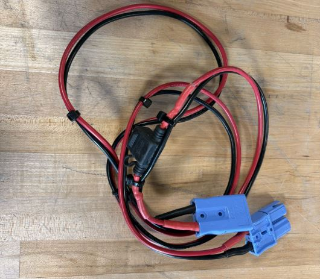 |
| 4 | Big Gray IEC Cable | MATE ROV Shelf | 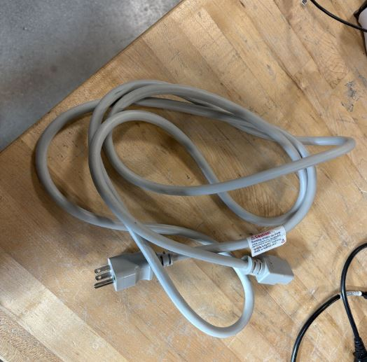 |
| 5 | Main Power Supply | MATE ROV Shelf | |
| 6 | Robot | MATE ROV Robot table | |
| 7 | Air Compressor | MATE ROV Robot table | |
| 8 | Yellow Extension Cord | MATE ROV Robot table | |
| 9 | Dell Competition Laptop (the laptop that is gray and thick) | Computer Shelf | 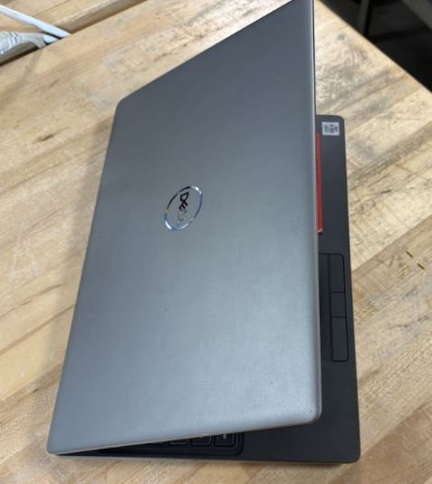 |
| 10 | Pilot Controller | Computer Shelf | 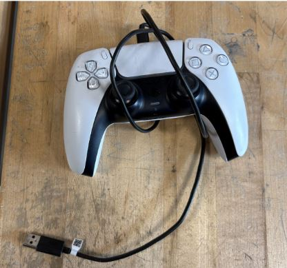 |
| 11 | IEC Cable (black cable) | Computer Shelf | 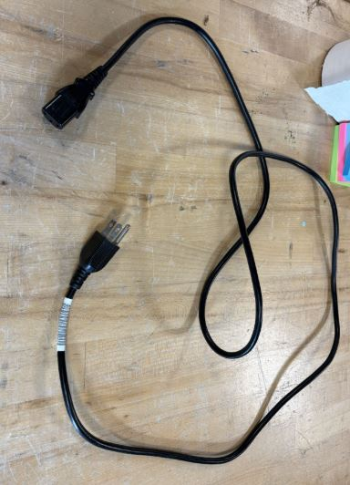 |
| Not Pictured above | IEC Cable (black cable) | Inside the Control Box |  |
| Not Pictured above | Power Strip | On one of the work tables | |

You only need one of the power supplies. If you use the Main Power Supply, you need the Gray Cable. If you use the Backup Power Supply, you need a total of 2 IEC Cables (black cables)

## Setup

### Control Box

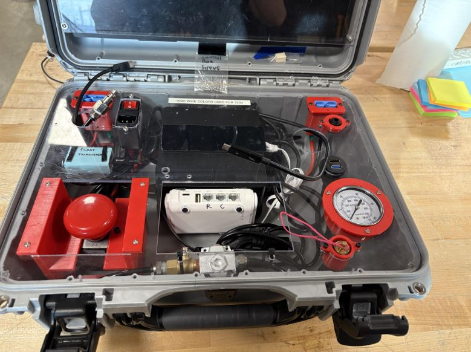

**Note:** The three wires sticking up out of the box are normally inside the box. You need to fish them out of the box.

1. Remove the black IEC cable from inside the control box, and pull out any cables so that at least the two black USB-c cables are sticking out (don't have to pull out the pneumatics if not using them)

2. Arrange control box and whichever power supply you are using with the power supply to the left of the control box.

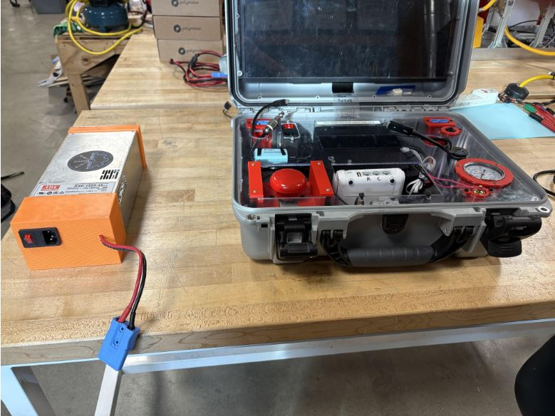

3. Connect the power cord extension (component 3) to the power supply. Attach the cord with the fuse (the black box on the cord) towards the power supply. The blue connectors can be hard to fully connect, make sure to apply enough pressure that they click together.

    a. **Main Power Supply:** The extension plugs into the blue connector in the upper right of the power supply.

    b. **Backup Power Supply:** The extension plugs into the blue connector that is on a short cord coming out of the end of the power supply.

4. Plug the other end of the extension into the top left corner of the control box.

5. Connect the power supply to power.

    a. **Main Power Supply:** Plug the big gray IEC cable into the port on the righthand side of the power supply. Plug the other end of the cord into the power strip.

    b. **Backup Power Supply:** Plug one of the black IEC cables into the port on the end of the power supply. Plug the other end of the cord into the power strip.

At this point your set up should look like below:

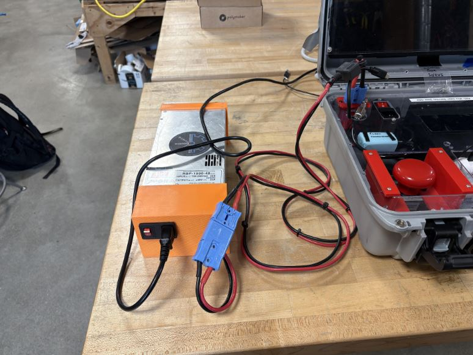

6. Blug the leftmost black USB-c connector coming from the control box into the bonitor. The cord will need to go through the hole in the side of the control box that is covered in gray tape. Note: there are multiple ports in that area of the monitor, if the cord is not wanting to plug in, make sure you are attempting to plug into one of the USB-c ports because some of the port look similar.

7. Plug a black IEC cable into the port in the upper left of the control box, directly underneath the power switch. Plug the other end into the power strip.

At this point you should have the following set up:

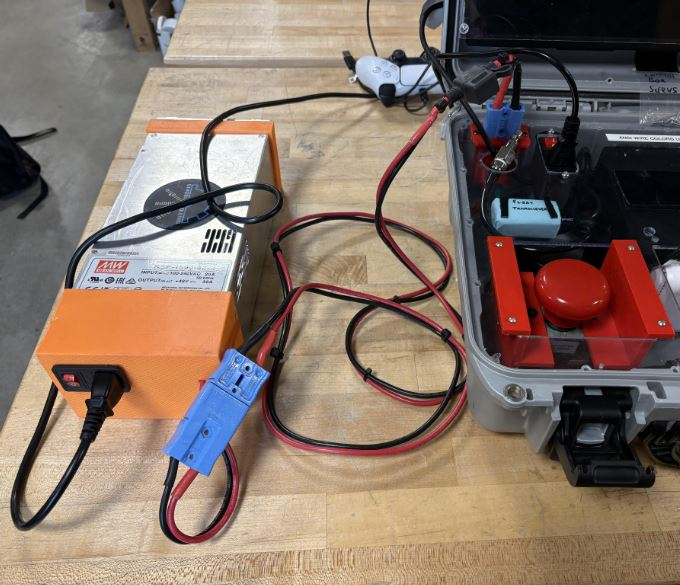

8. Plug the USB-c cord that is in the center of the control box into the white router (the white thing with the googley eyes). The port is on the top of the router on the lefthand side, it says power above the port.

9. Plug the white ethernet cord that is inside the control box into the right-most port on the router. The port is labeled WAN.

At this point you should have the following:

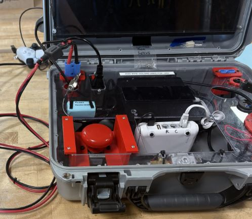

10. Plug the controller (component 10) in. You can plug it directly into the right-hand side of the laptop, or into the USB port on the righthand side of the control box. If the controller is missing a cord, it takes a USB-c data cable.

11. Prop the computer up on the laptop stand to the right of the control box. If the actual laptop stand is unavailable, use 2-3 books if in the bay, or 3 dry kickboards if at the pool. The goal is to have the ports of the laptop be level with the edge of the control box so that the cords don't bend as much. 

12. Plug the right-most USB-c cord into the USB-c ports on the left side of the competition laptop.

The setup should now look like this:

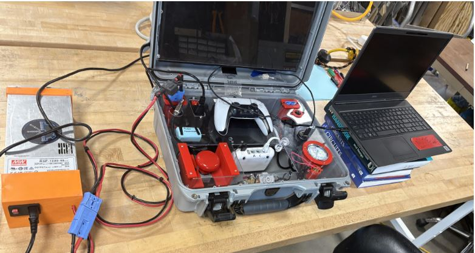

If you are using the pnuematics, proceed to [Setting up pnuematics](#setting-up-pnuematics), otherwise proceed to [Connecting the robot](#connecting-the-robot)

### Setting up pnuematics

1. Plug the air compressor's (component 7) power cord into the power strip.

2. Pull the silver pneumatic connector out of the leftmost circle on the control box nd connect it to the compressor.

    a. Press the outer part of the connector on the compressor in towards the compressor

    b. Insert the pnuematic cord fully

    c. release the connector on the compressor

    d. If you didn't insert the cord far enough, it will immediately come out. Keep trying until the cord is connected

3. Ensure the valve inside the control box is closed. The valve is inside the front center of the control box. The handle should be at a right-angle to the cord for it to be closed.

4. Turn the compressor on with the switch on the back left of the compressor.

5. Ensure that once the compressor has finished running, the righthand dial on the compressor reads 40 psi. 

### Connecting the Robot

1. On the end of the tether, there are four things:

    a. The power cord (with a blue connector similar to component 3)

    b. an ethernet cord

    c. the strain relief (orange 3d print with a carabiner)

    d. The pneumatics tube (black tube with no connector on the end)

2. Attach the carabiner to the metal loop in the bottom right of the control box, next to the control box latch.

3. Plug the power cord into the rightmost power connector in the control box. It is in the back right.

4. Plug the ethernet cord into the router in the port labeled with an R.

5. If using pnuematics, connect the pnuematics tube. To do so, insert the pnuematics tube into the connector on the control box. The connector looks like a circle on the right-hand side of the control box and is imediately below where the robot's power cord connects.

The control box should look like the following (photo does not include pnuematics):

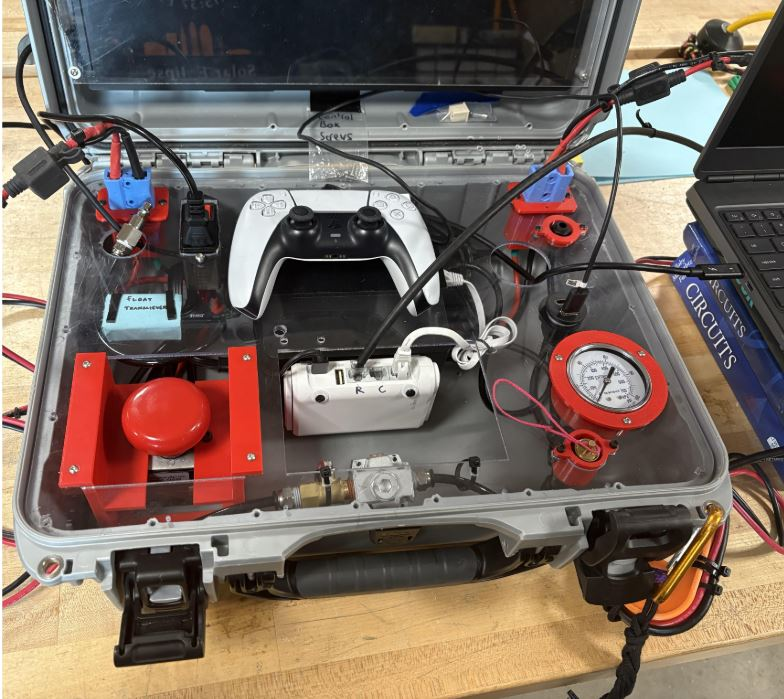

### Turn Everything On

1. Flip the power connector in the control box. There should now be a white light from the bottom of the router, and once the competition laptop is on, the monitor should turn on.

2. Ensure that the E-stop is pressed down (big red button in the bottom left of the control box). Then turn on the power supply.

    a. **Main Power Supply:** Flip the big black switch and then the small metal switch to the on positions.

    b. **Backup Power Supply:** Flip the red power switch to the on position. 

    After this, you should hear the fans on the power supply start running.

3. Open the pnuematics valve. The valve is located in the front of the control box, the handle of the valve should be parallel with the cord for it to be open. The dial in the bottom right of the control box should show 40 psi. If it does not, adjust the knob on the compressor until the dial reads 40 psi.

4. To turn on the robot, lift up the E-stop (big red button in the bottom left of the control box). You should hear a beeping sound from the robot. If you do not hear that sound, ensure the power supply is on (it's fans should be running), and check that both power connectors in the control box are fully clicked into place.

5. At this point, wait a minute, and there should be a second set of beeps that signal that BlueOS is turned on and the robot can be connected to.

### Run the GUI

1. Open VS Code (looks like a blue triangle in the task bar)

2. Run `. install/setup.sh` in the vs code terminal (at the bottom of the screen)

3. Run `ros2 launch surface_main surface_all_nodes_launch.py` in the vs code terminal.

4. The GUI should be ready

## Tear Down

### Initial power off

1. Press the E-stop (big red button) to kill power to the robot.

2. Turn off the power switch in the control box, and the power switches on the power supply.

3. If you used the compressor, follow the [Take Down the Compressor](#disconnecting-pneumatics) steps below.

4. Unplug all of the wires.

    a. The power connectors can be difficult to unplug. Hold down the control box, and wiggle the connector side to side. This takes quite a bit of force.

5. Put the cords that stay in the control box back under the control box lid. Ensure the IEC cable goes back into the control box.

6. Put everything back away according to the components section.

### Disconnecting Pneumatics

1. Close the pneumatics valve. The valve is in the front center of the control box. Turn the handle so that it is perpendicular to the cord to close the valve.

2. Turn off the compressor with the switch on the back left of the compressor.

3. Pull up the pressure relief switch (gold circle with a pink string) on the control box. Keep pulling on it until you no longer hear air being released.

4. Use the pressure relief switch on the comporessor. It looks similar to the one in the control box, but it has a metal loop on the end and is on the front left of the compressor. Pull on it until you can't hear anymore air coming out. Sometimes it sill pull itself back in, or get hard to hold it open, if that happens make sure to open it again to make sure there is no more air.

5. Unplug the pnuematic tube on the tether.

    a. Press down on the small upper ring of the connector in the control box to release the tube.

6. Unplug the compressor from the control box. Press the connector on the compressor in towards the compressor to release.

7. Put the pnuematis cord back underneath the control box panel.

8. Unplug the compressor from the power strip and wrap the cord back around the hooks on the side of the compressor.

9. Drain the compressor.

    a. Take it over to a drain (usually there is one in the floor at Donnel near where everything is set up)

    b. Open the valve in the bottom of the drain.

    c. Tilt the compressor and make sure any water drips out. Sometimes it helps to *lightly* shake the compressor. There may or may not be water depending on how much the manips were used and how much the compressor needed to turn back on.

    d. close the valve
